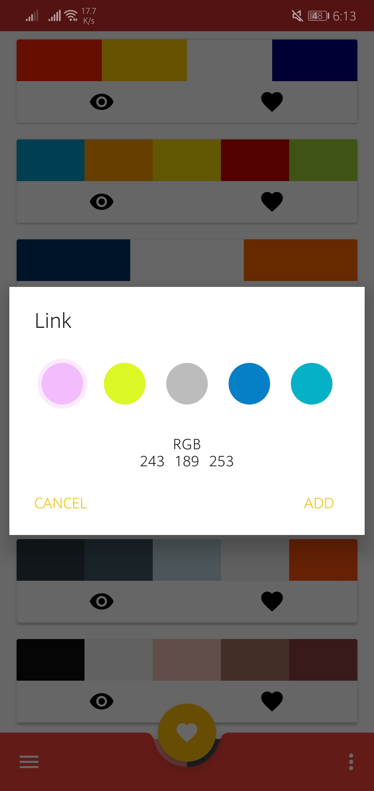

# Color Assistant
<strong>Идея</strong> по помощнику пользователям в поиске, передаче и создании комбинированных цветов.  
Приложение писалось давно и в будущем будет полностью переделан, по причине того, что это не Single Activity (Смешная причина). Также список того, что приложение может:
* [Создание своих комбинированных цветов (Конструктор)](https://github.com/FromSi/Color_Assistant/blob/master/screenshot/img4.jpg)
* [Передача комбо цветов по URL и QR кода](https://github.com/FromSi/Color_Assistant/blob/master/screenshot/img6.jpg)
* [Предпросмотр переданного комбо цветов](https://github.com/FromSi/Color_Assistant/blob/master/screenshot/img7.jpg)
* [Сканер QR кода](https://github.com/FromSi/Color_Assistant/blob/master/screenshot/img5.jpg)
* [Кастомизация темы в приложении](https://github.com/FromSi/Color_Assistant/blob/master/screenshot/img9.jpg)
* [Подробная информация цвета (HEX, RGB, HSV, CMYK)](https://github.com/FromSi/Color_Assistant/blob/master/screenshot/img1.jpg)
* [Глобальный (с сервера) и локальный список комбинированных цветов](https://github.com/FromSi/Color_Assistant/blob/master/screenshot/img2.jpg)
* [Вычисление доминирующих цветов на картинке](https://github.com/FromSi/Color_Assistant/blob/master/screenshot/img3.jpg)
* [Предпросмотр в cветлм-тёмном или насыщенном состоянии цвета](https://github.com/FromSi/Color_Assistant/blob/master/screenshot/img8.jpg)
<strong>Пока только идея с кодом :)</strong>

## Sreenshots
<table>
  <tbody>
    <tr>
      <td align="center" valign="middle">
        
      </td>
      <td align="center" valign="middle">
        
      </td>
      <td align="center" valign="middle">
        
      </td>
    </tr>
    <tr>
      <td align="center" valign="middle">
        
      </td>
      <td align="center" valign="middle">
        
      </td>
      <td align="center" valign="middle">
        
      </td>
    </tr>
    <tr>
      <td align="center" valign="middle">
        
      </td>
      <td align="center" valign="middle">
        
      </td>
      <td align="center" valign="middle">
        
      </td>
    </tr>
  </tbody>
</table>

## Thanks for the Color Thief
* Henrique Rocha - for the Java Color Thief version available at https://github.com/HenriqueRocha/android-colorthief
* Simon Oualid (simon@oualid.net) - for the Java Color Thief version available at https://github.com/soualid/java-colorthief
* Lokesh Dhakar - for the original Color Thief javascript version, available at http://lokeshdhakar.com/projects/color-thief/

## License

 	 Copyright 2018 Vlad Weber-Pflaumer

 	 Licensed under the Apache License, Version 2.0 (the "License");
 	 you may not use this file except in compliance with the License.
 	 You may obtain a copy of the License at

 	     http://www.apache.org/licenses/LICENSE-2.0

 	 Unless required by applicable law or agreed to in writing, software
	 distributed under the License is distributed on an "AS IS" BASIS,
 	 WITHOUT WARRANTIES OR CONDITIONS OF ANY KIND, either express or implied.
 	 See the License for the specific language governing permissions and
 	 limitations under the License.

